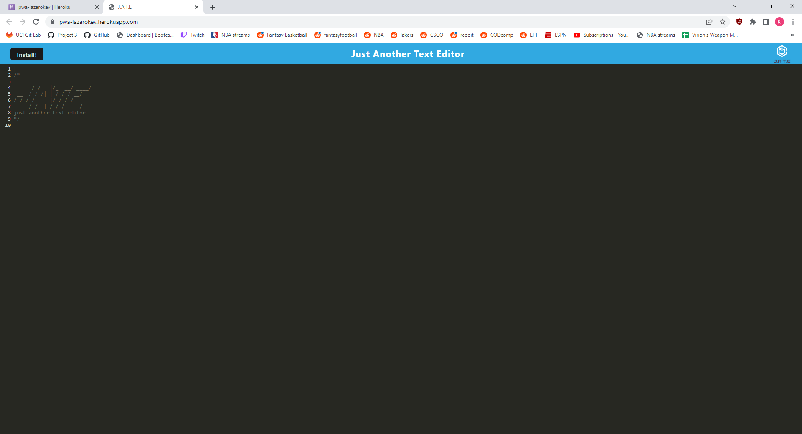

# PWA-Text-Editor

## Description
A text editor that runs in the browser. The app will be a single-page application that meets the PWA criteria. [Link to deployed heroku site!](https://pwa-lazarokev.herokuapp.com/)

## Table of Contents:
* [Installation](#installation)
* [Usage](#usage)
* [License](#license)
* [Contributing](#contributing)
* [Tests](#tests)
* [Questions](#questions)

## Installation
* Download and clone the repository to your machine
* In the CLI, enter these commands below
    * `npm i` to install dependencies
    * `npm start` to begin start application

## Usage:
Application Preview

* Node.js
* Express.js
* HTML
* CSS
* Javascript

## License:
This Project is licensed under: Apache 2.0

## Contributing:
Fill free to contact me to contribute to this project

## Tests:
No tests at the moment

## Questions:
If there are questions you can reach me via github/email. Listed below
- https://github.com/keeezy
- lazarokev@gmail.com 
